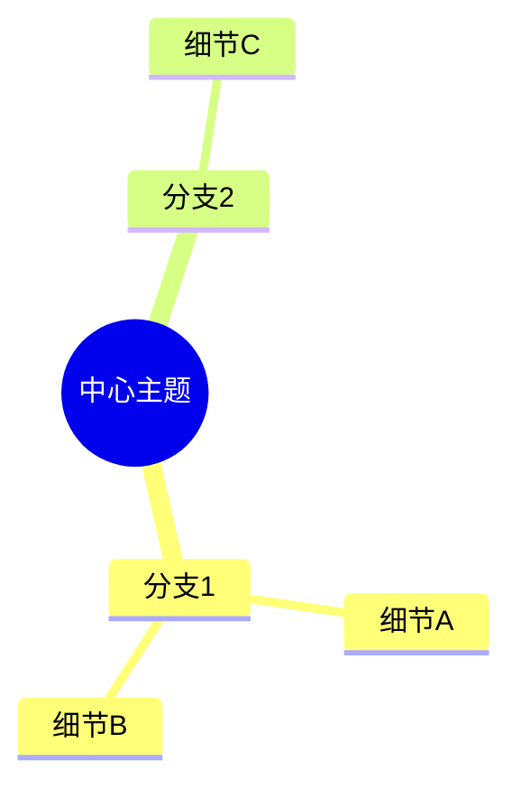

# 人生实验室 · Life Lab — Plan State 7

> **文档目的：** 第七阶段——平台柔化 + M12 深度化。两个方向，小而精。
> **上一阶段：** State 6（M11 游戏化互动 + M10/M12 增强 + 零成本推广——全部完成）
> **当前状态：** 12 个模块端到端可用。但用户的控制力弱——参数硬编码、Pipeline 没有循环、worker 不能处理附件、工具不能按节点定制。本阶段补上这些。

---

## Step 速查表

| Step | 名称 | 依赖 | 核心产出 | 估时 |
|------|------|------|----------|------|
| **⚙️ 平台柔化** | | | | |
| 103 | 用户可调参数面板 | config.py | Settings API + 前端面板 + 全部硬编码替换为 settings 引用 | 2h |
| **🔧 Pipeline 深度化** | | | | |
| 104 | 结点模型重构 + Edge + Loop/Branch | pipeline.py | 显式 PipelineEdge + role/produces + 拓扑排序支持 Loop + 条件分支 | 6h |
| 105 | 特殊工具 (8个) + 可选工具 | 104, tools.py | SpecialToolSpec 注册表 + 8 个 handler + per-node 工具过滤 | 5h |
| 106 | 图形化管线编辑器 | 104, PipelinePage | React Flow 画布 + 节点按 role 着色 + flow/loop/branch 三种线型 + 自动布局 | 8h |

> **共 4 个 Step，~21 小时。** 103 独立；104→105→106 强依赖。

---

## Step 103 — 用户可调参数面板

> **目标：** 把硬编码在 `config.py` 和各 engine 里的参数暴露给用户。一个面板——滑块+开关+预设——改完即生效。
> **设计原则：** 不引入新配置格式。`UserSettings` 是 Pydantic 模型——默认值来自现有硬编码。改一个参数 = 改一个字段。

### 需要暴露的参数

```
┌─ ⚙️ 平台设置 ─────────────────────────────────────────────────┐
│                                                              │
│ 🧠 Agent 决策                          [恢复此组默认]          │
│ ┌──────────────────────────────────────────────────────────┐ │
│ │ 思考深度 (temperature)     [0.3──────●──0.8──────1.5]    │ │
│ │  低=更确定  高=更多样                                      │ │
│ │                                                          │ │
│ │ 决策随机性                  [0%───●──5%──────20%]         │ │
│ │  Agent 偶尔做反常选择的概率                                  │ │
│ └──────────────────────────────────────────────────────────┘ │
│                                                              │
│ 💬 M11 场景                             [恢复此组默认]          │
│ ┌──────────────────────────────────────────────────────────┐ │
│ │ 主动搭话频率                [很少───●──────经常]            │ │
│ │                                                          │ │
│ │ 空闲暂停时间                [1min──●─5min────30min]       │ │
│ │                                                          │ │
│ │ 情绪衰减速度                [慢─────●──────快]             │ │
│ └──────────────────────────────────────────────────────────┘ │
│                                                              │
│ 🛠️ M12 Worker                          [恢复此组默认]          │
│ ┌──────────────────────────────────────────────────────────┐ │
│ │ 最大步数                    [10─────●30─────50]           │ │
│ │                                                          │ │
│ │ 自我修正次数                [1──────●3──────10]           │ │
│ │  (Agent 最多允许改几版)                                     │ │
│ │                                                          │ │
│ │ 超时时间 (分钟)              [5──────●15─────30]           │ │
│ └──────────────────────────────────────────────────────────┘ │
│                                                              │
│ [全部恢复默认]  [保存]                                          │
└──────────────────────────────────────────────────────────────┘
```

### 参数与硬编码的对应关系

| 面板参数 | 现有硬编码位置 | 默认值 |
|---------|--------------|--------|
| 思考深度 (temperature) | `config.py:LLM_TEMPERATURE_THINK` / `LLM_TEMPERATURE_ACT` | think=0.8, act=0.5 |
| 决策随机性 | `prompt_templates.py` 行为准则第 5 条 "偶尔做反常选择（概率约 5%）" | 5% |
| 主动搭话频率 | `ProactiveChatManager.ts` 内部常量 | 4-8 分钟 |
| 空闲暂停时间 | `GameScene.tsx` 硬编码 5 分钟 | 5 分钟 |
| 情绪衰减速度 | `EmotionEngine.ts:decay_interval` | 15s |
| 最大步数 | `engine.py:MAX_ITERATIONS` | 30 |
| 自我修正次数 | Worker 硬编码（无上限——只要有步数就一直改） | 3 |
| 超时时间 | Worker 硬编码（无全局超时——只有单步 tool 30s 超时） | 15 分钟 |

### 实现

```python
# config.py — 新增

class UserSettings(BaseModel):
    """用户可调的运行时参数。通过 API 读写，localStorage 前端缓存。"""
    
    # Agent 决策
    temperature_think: float = Field(default=0.8, ge=0.1, le=1.5)
    temperature_act: float = Field(default=0.5, ge=0.1, le=1.5)
    randomness_pct: float = Field(default=5.0, ge=0.0, le=30.0)
    
    # M11 场景
    proactive_chat_interval_min: int = Field(default=6, ge=1, le=30)
    idle_pause_minutes: int = Field(default=5, ge=1, le=60)
    emotion_decay_seconds: int = Field(default=15, ge=5, le=60)
    
    # M12 Worker
    worker_max_steps: int = Field(default=30, ge=5, le=50)
    worker_max_revisions: int = Field(default=3, ge=1, le=10)
    worker_timeout_minutes: int = Field(default=15, ge=5, le=30)

# 全局单例——启动时从 DB 加载，无则用默认值
_settings: UserSettings | None = None

def get_settings() -> UserSettings:
    if _settings is None:
        load_settings()
    return _settings
```

### 涉及文件

| 文件 | 操作 | 说明 |
|------|------|------|
| `backend/src/config.py` | 修改 | 新增 `UserSettings` 模型 + 全局单例 + load/save |
| `backend/src/api/settings.py` | **新建** | `GET/PUT /api/settings` |
| `backend/src/main.py` | 修改 | 注册 settings router |
| `backend/src/llm/client.py` | 修改 | `create_model_client` 从 settings 读温度——不再读 `config.settings` 常量 |
| `backend/src/engines/worker/engine.py` | 修改 | `MAX_ITERATIONS` → `get_settings().worker_max_steps`；新增全局超时 |
| `backend/src/engines/persona/prompt_templates.py` | 修改 | 随机偏差百分比 → `get_settings().randomness_pct` |
| `frontend/src/pages/SettingsPage.tsx` | **新建** | 设置面板——滑块+开关+恢复默认+保存 |
| `frontend/src/api/settings.ts` | **新建** | `useSettings` / `useUpdateSettings` hooks |
| `frontend/src/App.tsx` | 修改 | `/settings` 路由 |
| `frontend/src/components/layout/Sidebar.tsx` | 修改 | 侧边栏底部齿轮图标 → 设置页 |

### 验收标准

- [ ] 打开设置页 → 8 个滑块显示当前值（默认值首次）
- [ ] 拖动"思考深度"到 0.3 → 保存 → Worker 任务的 Agent 发言更确定（手动对比）
- [ ] 拖动"主动搭话频率"到"经常"→ M11 Agent 搭话间隔明显缩短
- [ ] 点击"恢复默认"→ 参数回到初始值
- [ ] 刷新页面 → 设置保持（localStorage + API 双重持久化）
- [ ] 各个 engine 读取的参数确实来自 settings（不再是硬编码常量）
- [ ] 滑块有范围限制——不能设到非法值（`ge`/`le` 在 Pydantic 层拦截）

---

## Step 104 — 结点模型重构 + PipelineEdge + Loop/Branch

> **目标：** 重构 Pipeline 数据模型，引入显式边、结点角色、数据契约，为 Loop 和 Branch 打地基。

### ① 结点模型重构

#### 设计

当前 `PipelineNodeSpec` 只有 6 个字段（id/title/agent_id/task/depends_on/depends_on_files），所有结点同质化——质检结点和分析结点用同一个 system prompt，区分度靠 task 字符串碰运气。

**重构后的结点模型：**

```python
@dataclass
class PipelineNodeSpec:
    """管道节点规格——描述管道中的一个步骤。"""
    # ── 基础标识 ──
    id: str                           # 唯一标识（英文，如 "research" / "analyze" / "write" / "review"）
    title: str                        # 人类可读的标题
    agent_id: str                     # 执行此节点的 Agent ID

    # ── 任务定义 ──
    task: str                         # 此节点的任务描述（自然语言）
    role: str = "worker"              # 结点角色，影响 system prompt
                                      #   "analyst"  — 分析师：发现规律、总结洞察
                                      #   "writer"   — 写手：生成结构化文档
                                      #   "reviewer" — 审稿人：挑错、打分、提修改意见
                                      #   "executor" — 执行者：运行代码、调用工具
                                      #   "worker"   — 默认（不限定角色）

    # ── 数据契约 ──
    produces: list[str] = field(default_factory=list)
                                      # 本结点承诺产出的文件清单，如 ["report.md", "chart.png"]
                                      # 下游结点可据此判断输入是否就绪
    expects: list[str] = field(default_factory=list)
                                      # 本结点需要的输入文件清单（从上游 produces 自动推断，也可手写）

    # ── 依赖（迁移到显式 Edge 后逐步废弃）──
    depends_on: list[str] = field(default_factory=list)      # 过渡期保留，Step 106 后废弃
    depends_on_files: list[str] = field(default_factory=list)

    # ── 工具 ──
    extra_tools: list[str] = field(default_factory=list)     # 本结点专属工具（Step 105）
    enabled_tools: list[str] = field(default_factory=list)   # 精确控制可用工具（空=全部）
```

**`role` 如何影响 Agent 行为：**

> 每个角色的 system prompt 加一行角色定义，其余保持不变。
>
> - **analyst**：`你是数据分析师。你的职责是发现规律、总结洞察、指出异常。不要下结论，先呈现事实。`
> - **writer**：`你是内容写手。你的职责是将分析结果转化为结构清晰、可读性强的文档。使用标题、列表、表格来组织内容。`
> - **reviewer**：`你是审稿人。你的职责是挑错——检查数据准确性、逻辑一致性、格式规范。输出 PASS/FAIL + 具体修改建议。`
> - **executor**：`你是执行者。你的职责是运行代码、调用工具、验证结果。遇到错误先尝试修复，不要直接放弃。`
> - **worker**（默认）：无额外角色定义，保持现有行为。

### ② PipelineEdge — 显式边

#### 设计

当前边是隐式的（`depends_on` 列表）。显式 `PipelineEdge` 是 Loop 和 Branch 的前提——边本身携带控制流信息。

```python
from enum import Enum

class EdgeType(str, Enum):
    FLOW = "flow"         # 普通数据流（实线）：A 产出文件 → B 读取
    LOOP = "loop"         # 回边（虚线弧线）：质检 FAIL → 回到分析重新来
    BRANCH = "branch"     # 条件分支（点线）：质检 PASS → 跳到发布

@dataclass
class PipelineEdge:
    """管道中的一条有向边，从源节点指向目标节点。"""
    id: str                           # 边 ID（如 "e_review_loop_analyze"）
    from_node: str                    # 源节点 ID
    to_node: str                      # 目标节点 ID
    edge_type: EdgeType = EdgeType.FLOW

    # ── 条件（Loop 和 Branch 共用）──
    condition: str | None = None      # 触发条件表达式
                                      # 简单模式："FAILED" → 检查结点输出是否包含 FAILED
                                      # 数值模式："score < 0.7" → 从结点输出中提取 score 值
                                      # 正则模式："/error|失败/" → 匹配结点输出
    condition_field: str | None = None
                                      # 从结点产出的哪个文件读取条件值
                                      # 如 "review.json" → 读取 json → 取 condition 指定的字段

    # ── Loop 专属 ──
    max_iterations: int = 3           # 最大循环次数
    iteration_label: str = ""         # 循环标签（前端显示用，如 "第{n}次修改"）

    # ── Branch 专属 ──
    priority: int = 0                 # 分支优先级（多条 branch 边同时满足 → 选 priority 最高的）
    label: str = ""                   # 分支标签（前端显示用，如 "通过" / "驳回"）
```

**边的可视化区分：**

```
 flow:   ●───────→●  实线，黑色/主题色
 loop:   ● ╮       ╭ ●  虚线弧线，从下游弯回上游，橙色
         ● ╯       ╰ ●
branch:  ●------->●  点线，绿色(PASS)/红色(FAIL)
```

**PipelineSpec 加 edges 字段：**

```python
@dataclass
class PipelineSpec:
    id: str
    name: str
    description: str = ""
    nodes: list[PipelineNodeSpec] = field(default_factory=list)
    edges: list[PipelineEdge] = field(default_factory=list)   # ← 新增
    status: PipelineStatus = PipelineStatus.DRAFT
```

### ③ 执行引擎改动

```
PipelineEngine.execute(pipeline, workspace, get_agent_fn):

  1. 拓扑排序（只考虑 FLOW 边；LOOP/BRANCH 不参与排序）
  2. iteration_counts = {}  # edge_id → 已迭代次数
  3. branch_taken = set()   # 已触发的 branch 边（防止重复分支）

  for level in topological_levels:
    for node in level:
      # 检查是否有 branch 边跳过了本结点
      if any_branch_skipped_this_node(node): continue

      run_node(node)

      # 检查以该结点为起点的 loop 边
      for edge in get_loop_edges_from(node.id):
        if eval_condition(edge, run_output):        # 条件满足
          if iteration_counts[edge.id] < edge.max_iterations:
            re_enqueue(path_between(edge.to_node, edge.from_node))
            iteration_counts[edge.id] += 1
            log(f"[loop] {edge.id}: 第 {iteration_counts[edge.id]} 次循环")
          else:
            log(f"[loop] {edge.id}: 达到上限 {edge.max_iterations}，停止循环")

      # 检查以该结点为起点的 branch 边
      for edge in get_branch_edges_from(node.id):
        if eval_condition(edge, run_output):
          branch_taken.add(edge.id)
          # 将 branch 目标之后的结点加入执行队列
          # 跳过当前路径上被 branch 绕过的结点
```

---

## Step 105 — 特殊工具节点 + 工具注册表

> **目标：** ① 8 个预设特殊工具，覆盖思维导图/图表/时间线/摘要/翻译/数据分析/代码审查/大纲生成；② Worker 单任务的工具可由用户勾选开关。

### ① 8 个预设特殊工具

#### 工具总览

| # | 工具名 | 输入 | 产出 | 实现方式 | 适用角色 |
|---|--------|------|------|----------|----------|
| 1 | `mindmap_generate(topic)` | 主题字符串 | Mermaid 思维导图 → `mindmap.md` | LLM prompt 模板 | analyst, writer |
| 2 | `chart_generate(data_json, chart_type)` | JSON 数据 + 图表类型(bar/line/pie/scatter) | matplotlib PNG → `chart.png` | Python 子进程执行 matplotlib | analyst, executor |
| 3 | `timeline_generate(events_json)` | 事件 JSON 数组 `[{date, title, desc}]` | 交互式时间线 → `timeline.html` | HTML 模板填入数据 | writer, analyst |
| 4 | `summarize(path, max_words=200)` | 文件路径 | 结构化摘要 → `summary.md` | LLM prompt——"请用不超过{max_words}字总结" | analyst, writer |
| 5 | `translate(path, target_lang="en")` | 文件路径 + 目标语言 | 翻译后文件 → `{name}_{lang}.md` | LLM 分段翻译 + 合并 | writer |
| 6 | `data_profile(path)` | CSV/JSON 文件路径 | 数据画像 → `data_profile.md`（行数/列名/类型/缺失率/分布摘要/相关性 Top5） | Python pandas 子进程 | analyst |
| 7 | `code_review(path)` | 代码文件路径 | 代码审查报告 → `code_review.md`（bug/风格/性能/安全 4 维度） | LLM prompt 模板 | reviewer |
| 8 | `outline_generate(topic, sections=5)` | 主题 + 章节数 | 文档大纲 → `outline.md`（Markdown 层级标题） | LLM prompt 模板 | writer |

#### 各工具详细设计

**① mindmap_generate — 思维导图生成器**

```python
def mindmap_handler(topic: str, workspace) -> ToolResult:
    """基于主题生成 Mermaid 格式思维导图。"""
    prompt = f"""你是一个思维导图生成器。基于以下主题生成 Mermaid mindmap 格式的思维导图。

主题：{topic}

要求：
- 至少 3 层深度（中心 → 分支 → 细节）
- 使用 Mermaid mindmap 语法
- 输出格式：

- 不要输出任何非 Mermaid 的内容
"""
    result = call_llm(prompt, max_tokens=500)
    workspace.write("mindmap.md", result)
    return ToolResult(success=True, output_file="mindmap.md")
```

**② chart_generate — 图表生成器**

```python
def chart_handler(data_json: str, chart_type: str, workspace) -> ToolResult:
    """在沙盒中用 matplotlib 生成图表 PNG。"""
    code = f"""
import matplotlib
matplotlib.use('Agg')
import matplotlib.pyplot as plt
import json

data = json.loads('''{data_json}''')

fig, ax = plt.subplots(figsize=(10, 6))
# 根据 chart_type 选择绘图方式
chart_funcs = {{
    'bar': lambda: ax.bar(data.get('labels', []), data.get('values', [])),
    'line': lambda: ax.plot(data.get('labels', []), data.get('values', [])),
    'pie': lambda: ax.pie(data.get('values', []), labels=data.get('labels', []), autopct='%1.1f%%'),
    'scatter': lambda: ax.scatter(data.get('x', []), data.get('y', [])),
}}
if '{chart_type}' in chart_funcs:
    chart_funcs['{chart_type}']()
    ax.set_title(data.get('title', 'Chart'))
    plt.tight_layout()
    plt.savefig('chart.png', dpi=150)
    print('OK')
else:
    print(f'ERROR: unknown chart_type "{chart_type}", use bar/line/pie/scatter')
"""
    result = run_python_sandbox(code, workspace)
    return ToolResult(success="OK" in result, output_file="chart.png")
```

**③ timeline_generate — 时间线生成器**

```python
def timeline_handler(events_json: str, workspace) -> ToolResult:
    """生成交互式 HTML 时间线。"""
    events = json.loads(events_json)
    items_html = ""
    for i, ev in enumerate(events):
        side = "left" if i % 2 == 0 else "right"
        items_html += f"""
        <div class="timeline-item {side}">
            <div class="timeline-date">{ev.get('date', '')}</div>
            <div class="timeline-content">
                <h3>{ev.get('title', '')}</h3>
                <p>{ev.get('desc', '')}</p>
            </div>
        </div>"""

    html = TIMELINE_TEMPLATE.replace("{{ITEMS}}", items_html)
    workspace.write("timeline.html", html)
    return ToolResult(success=True, output_file="timeline.html")
```

**④ summarize — 智能摘要**

```python
def summarize_handler(path: str, max_words: int = 200, workspace) -> ToolResult:
    content = workspace.read(path)
    prompt = f"请用不超过{max_words}字总结以下内容，保留关键数据和结论：\n\n{content[:8000]}"
    result = call_llm(prompt, max_tokens=400)
    workspace.write("summary.md", result)
    return ToolResult(success=True, output_file="summary.md")
```

**⑤ translate — 文档翻译**

```python
def translate_handler(path: str, target_lang: str = "en", workspace) -> ToolResult:
    content = workspace.read(path)
    # 分段翻译（> 4000 字时分段，每段 2000 字）
    chunks = split_text(content, 2000)
    translated = []
    for i, chunk in enumerate(chunks):
        prompt = f"将以下内容翻译为{target_lang}，保持 Markdown 格式不变：\n\n{chunk}"
        translated.append(call_llm(prompt, max_tokens=600))
    basename = Path(path).stem
    output_path = f"{basename}_{target_lang}.md"
    workspace.write(output_path, "\n\n".join(translated))
    return ToolResult(success=True, output_file=output_path)
```

**⑥ data_profile — 数据画像**

```python
def data_profile_handler(path: str, workspace) -> ToolResult:
    """用 pandas 生成数据画像报告。"""
    code = f"""
import pandas as pd, json
path = '{path}'
if path.endswith('.csv'): df = pd.read_csv(path)
elif path.endswith('.json'): df = pd.read_json(path)
else: raise ValueError('unsupported format')

report = []
report.append(f'# 数据画像: {path}')
report.append(f'\\n## 基本信息')
report.append(f'- 行数: {{len(df)}}')
report.append(f'- 列数: {{len(df.columns)}}')
report.append(f'- 内存: {{df.memory_usage(deep=True).sum() / 1024:.1f}} KB')
report.append(f'\\n## 列信息')
for col in df.columns:
    report.append(f'- **{{col}}** ({{df[col].dtype}}): 缺失 {{df[col].isna().sum()}} ({{df[col].isna().mean():.1%}})')
report.append(f'\\n## 数值列统计')
report.append(df.describe().to_markdown())
with open('data_profile.md', 'w') as f: f.write('\\n'.join(report))
print('OK')
"""
    result = run_python_sandbox(code, workspace)
    return ToolResult(success="OK" in result, output_file="data_profile.md")
```

**⑦ code_review — 代码审查**

```python
def code_review_handler(path: str, workspace) -> ToolResult:
    content = workspace.read(path)
    ext = Path(path).suffix
    prompt = f"""你是代码审查专家。请从以下 4 个维度审查这段 {ext} 代码：

1. **Bug 风险**：潜在的逻辑错误、边界条件、空值处理
2. **代码风格**：命名、注释、结构
3. **性能问题**：不必要的循环、内存浪费、IO 瓶颈
4. **安全隐患**：注入风险、敏感信息、权限问题

代码：
```{ext}
{content[:6000]}
```

输出格式（Markdown）：
## 审查报告: {path}
### 总体评分: X/10
### Bug 风险
- ...
### 代码风格
- ...
### 性能问题
- ...
### 安全隐患
- ...
"""
    result = call_llm(prompt, max_tokens=800)
    workspace.write("code_review.md", result)
    return ToolResult(success=True, output_file="code_review.md")
```

**⑧ outline_generate — 文档大纲生成器**

```python
def outline_handler(topic: str, sections: int = 5, workspace) -> ToolResult:
    prompt = f"""你是一个文档大纲生成器。请为以下主题生成 {sections} 章的文档大纲。

主题：{topic}

要求：
- 每章包含：章节标题 + 3-5 个要点
- 使用 Markdown 层级标题（## 第X章 ...）
- 结构从背景到结论，逻辑递进
- 不要输出其他内容
"""
    result = call_llm(prompt, max_tokens=500)
    workspace.write("outline.md", result)
    return ToolResult(success=True, output_file="outline.md")
```

#### 工具注册表

```python
# tools.py — SPECIAL_TOOLS 注册表

from dataclasses import dataclass
from typing import Callable

@dataclass
class SpecialToolSpec:
    name: str              # 工具函数名（Agent 看到的），如 "mindmap_generate"
    description: str       # 工具描述（出现在 Agent 的决策 prompt 中）
    parameters: dict       # {"param_name": {"type": "string", "required": bool}}
    handler: Callable      # Python 函数
    output_file: str       # 产出文件名
    icon: str = "🔧"       # 前端图标
    suitable_roles: list[str] = None  # 推荐角色，如 ["analyst", "writer"]

SPECIAL_TOOLS: dict[str, SpecialToolSpec] = {
    "mindmap": SpecialToolSpec(
        name="mindmap_generate",
        description="基于主题生成 Mermaid 思维导图，保存为 mindmap.md",
        parameters={"topic": {"type": "string", "required": True}},
        handler=mindmap_handler,
        output_file="mindmap.md",
        icon="🧠",
        suitable_roles=["analyst", "writer"],
    ),
    "chart": SpecialToolSpec(
        name="chart_generate",
        description="基于 JSON 数据生成图表（bar/line/pie/scatter），保存为 chart.png",
        parameters={
            "data_json": {"type": "string", "required": True},
            "chart_type": {"type": "string", "required": True},
        },
        handler=chart_handler,
        output_file="chart.png",
        icon="📊",
        suitable_roles=["analyst", "executor"],
    ),
    "timeline": SpecialToolSpec(
        name="timeline_generate",
        description="基于事件 JSON 数组生成交互式时间线 HTML",
        parameters={"events_json": {"type": "string", "required": True}},
        handler=timeline_handler,
        output_file="timeline.html",
        icon="📅",
        suitable_roles=["writer", "analyst"],
    ),
    "summarize": SpecialToolSpec(
        name="summarize",
        description="对指定文件生成结构化摘要，可指定字数上限，保存为 summary.md",
        parameters={
            "path": {"type": "string", "required": True},
            "max_words": {"type": "number", "required": False},
        },
        handler=summarize_handler,
        output_file="summary.md",
        icon="📝",
        suitable_roles=["analyst", "writer", "reviewer"],
    ),
    "translate": SpecialToolSpec(
        name="translate",
        description="将指定文件翻译为目标语言，支持中英日韩等",
        parameters={
            "path": {"type": "string", "required": True},
            "target_lang": {"type": "string", "required": False},
        },
        handler=translate_handler,
        output_file="(动态)",
        icon="🌐",
        suitable_roles=["writer"],
    ),
    "data_profile": SpecialToolSpec(
        name="data_profile",
        description="对 CSV/JSON 数据文件生成数据画像（统计摘要+缺失率+分布），保存为 data_profile.md",
        parameters={"path": {"type": "string", "required": True}},
        handler=data_profile_handler,
        output_file="data_profile.md",
        icon="📈",
        suitable_roles=["analyst"],
    ),
    "code_review": SpecialToolSpec(
        name="code_review",
        description="对代码文件进行 4 维度审查（bug/风格/性能/安全），保存为 code_review.md",
        parameters={"path": {"type": "string", "required": True}},
        handler=code_review_handler,
        output_file="code_review.md",
        icon="🔍",
        suitable_roles=["reviewer"],
    ),
    "outline": SpecialToolSpec(
        name="outline_generate",
        description="为主题生成结构化文档大纲（Markdown 层级标题），保存为 outline.md",
        parameters={
            "topic": {"type": "string", "required": True},
            "sections": {"type": "number", "required": False},
        },
        handler=outline_handler,
        output_file="outline.md",
        icon="📋",
        suitable_roles=["writer"],
    ),
}
```

#### 涉及文件

| 文件 | 操作 | 说明 |
|------|------|------|
| `backend/src/engines/worker/tools.py` | 修改 | 新增 `SpecialToolSpec` + `SPECIAL_TOOLS` 注册表 + 8 个 handler；`make_worker_tools` 支持 `extra_tools` 参数 |
| `backend/src/engines/worker/pipeline.py` | 修改 | `PipelineNodeSpec` 加 `role/produces/expects/extra_tools/enabled_tools` |
| `backend/src/engines/worker/engine.py` | 修改 | `AgentWorker.execute()` 支持 per-node tool registration/deregistration；system prompt 注入 role 定义 |
| `backend/src/engines/worker/pipeline_engine.py` | 修改 | 集成 role→prompt 映射；`PipelineEdge` 驱动的 loop/branch 逻辑 |
| `frontend/src/pages/PipelinePage.tsx` | 重写 | → 见 Step 106 |

### ② 单任务可选工具

```
┌─ 可用工具 ───────────────────────────────────────────┐
│ 基础:  [✓] web_search  [✓] write_file  [✓] read_file │
│        [✓] list_files  [✓] run_python [ ] install_pkg │
│ 特殊:  [✓] mindmap     [✓] chart       [ ] timeline  │
│        [✓] summarize   [ ] translate   [✓] data_profile│
└──────────────────────────────────────────────────────┘
```

AgentWorker 初始化时按 `enabled_tools` 过滤——不在此列表的工具 Agent 看不到也调不了。

#### 涉及文件

| 文件 | 操作 | 说明 |
|------|------|------|
| `backend/src/engines/worker/engine.py` | 修改 | `__init__` 加 `enabled_tools` 参数 |
| `backend/src/api/workers.py` | 修改 | `execute` 端点加 `enabled_tools` |
| `frontend/src/components/worker/ToolSelector.tsx` | **新建** | 工具开关——分类复选框组（基础/特殊） |

#### 验收标准 (Step 105)

- [ ] 8 个工具全部可调——每个用最小输入测试，产出文件内容正确
- [ ] Pipeline 节点 extra_tools=["mindmap"] → Agent 在该节点可调 mindmap_generate
- [ ] 节点完成后 → 下一个节点（extra_tools=[]）→ Agent 不能调 mindmap_generate
- [ ] Agent 的 decision prompt 只列出当前节点可见的工具
- [ ] WorkerBench 取消勾选"run_python" → Agent 全程不能调
- [ ] enabled_tools 为空 → 拒绝执行 + 提示"至少选择一个工具"
- [ ] 不传 enabled_tools → 默认所有工具可用（向后兼容）

---

## Step 106 — 图形化管线编辑器

> **目标：** 将当前表单列表编辑器重写为图形化画布编辑器——拖拽连线、可视化回边/分支、所见即所得。

### ① 技术选型

使用 **React Flow**（`@xyflow/react`，原名 reactflow）——最成熟的 React 图形化 DAG 编辑器库：

- 内置：拖拽节点 / 贝塞尔曲线连线 / 缩放平移 / 小地图 / 撤销重做
- 自定义：节点外观（按 role 着色）、边样式（flow/loop/branch 三种线型）、连接桩（Handle）
- 体积：~120KB gzipped，对现有 bundle 影响可控

### ② 布局设计

```
┌─ Pipeline 编辑区 ──────────────────────────────────────────┐
│                                                            │
│  ┌─ 工具栏 ──────────────────────────────────────────────┐ │
│  │ [+ 添加节点] [保存] [▶ 运行]  │  [撤销] [重做] [自动布局] │ │
│  └───────────────────────────────────────────────────────┘ │
│                                                            │
│  ┌─ 画布 (React Flow) ───────────────────────────────────┐ │
│  │                                                        │ │
│  │    ┌──────────┐      flow       ┌──────────┐           │ │
│  │    │ 📊       │                 │ 📝       │           │ │
│  │    │ 数据采集  │────────────────▶│ 数据分析  │           │ │
│  │    │ analyst  │                 │ analyst  │           │ │
│  │    └──────────┘                 └──────────┘           │ │
│  │         │                            │                 │ │
│  │         │ flow                  flow │                 │ │
│  │         ▼                            ▼                 │ │
│  │    ┌──────────┐      loop       ┌──────────┐           │ │
│  │    │ ✍️       │◀═══════════════ │ 🔍       │           │ │
│  │    │ 报告生成  │  FAILED, max3  │ 质检     │           │ │
│  │    │ writer   │                 │ reviewer │           │ │
│  │    └──────────┘                 └──────────┘           │ │
│  │         │                            │                 │ │
│  │         │ flow                  branch│ PASS            │ │
│  │         ▼                            ▼                 │ │
│  │    ┌──────────┐                 ┌──────────┐           │ │
│  │    │ 📤       │                 │ ✅       │           │ │
│  │    │ 归档     │                 │ 发布     │           │ │
│  │    │ executor │                 │ (跳过归档)│           │ │
│  │    └──────────┘                 └──────────┘           │ │
│  │                                                        │ │
│  └──────────────────────────────────────────────────────┘ │
│                                                            │
│  ┌─ 小地图 ──────────────────────────────────────────┐    │
│  │  [minimap]                                          │    │
│  └─────────────────────────────────────────────────────┘   │
└────────────────────────────────────────────────────────────┘

┌─ 右侧面板（选中节点时出现）─────────────────────────────────┐
│                                                            │
│  编辑节点: 数据分析                                         │
│  ┌──────────────────────────────────────────────────────┐ │
│  │ 标题: [数据分析                          ]            │ │
│  │ Agent: [worker-default              ▼]               │ │
│  │ 角色: [analyst         ▼]                            │ │
│  │                                                      │ │
│  │ 任务描述:                                             │ │
│  │ [分析 sales-2025.csv，找出销量趋势和异常值        ]   │ │
│  │                                                      │ │
│  │ 产出文件 (produces):                                   │ │
│  │ [analysis_report.md                ] [+添加]          │ │
│  │                                                      │ │
│  │ ▶ 特殊工具                                            │ │
│  │   [✓] 📊 chart_generate    [✓] 📝 summarize          │ │
│  │   [✓] 📈 data_profile      [ ] 🌐 translate          │ │
│  │                                                      │ │
│  │ ▶ 高级（回边/分支）                          [展开]    │ │
│  └──────────────────────────────────────────────────────┘ │
│                                                            │
└────────────────────────────────────────────────────────────┘
```

### ③ 节点外观（按 role 着色）

```
┌──────────────────────┐
│ ● 🔍                 │  ← 角色图标
│ 质检                  │  ← title
│ reviewer              │  ← role 标签
│ ──────────────────── │
│ 检查报告质量          │  ← task 摘要（截断 40 字）
│ → review_report.md   │  ← produces 文件
│ 🧰 mindmap, chart    │  ← extra_tools 徽章
└──────────────────────┘
  ○ 输入桩（左侧）  ○ 输出桩（右侧）

配色方案（按 role）：
  analyst  → 蓝紫色边框 #7c3aed，浅紫背景
  writer   → 翠绿色边框 #059669，浅绿背景
  reviewer → 琥珀色边框 #d97706，浅琥珀背景
  executor → 灰蓝色边框 #4b5563，浅灰背景
  worker   → 默认灰色边框
```

### ④ 连线交互

**创建 flow 边：**
1. 从源节点右侧输出桩拖出连线
2. 拖到目标节点左侧输入桩
3. 自动生成边 ID，默认 `edge_type=flow`

**创建 loop 回边：**
1. 选中下游节点（如质检）→ 右侧面板展开"高级"
2. 点击"添加回边"→ 选择目标节点（如数据分析）
3. 设置条件（如 `FAILED`）和最大次数（如 3）
4. 画布上渲染为虚线弧线，鼠标悬浮显示条件详情

> 回边不从桩上拖——因为它是"条件触发的控制流"，不是"文件传递的数据流"。交互上区分开，避免用户困惑。

**创建 branch 分支边：**
1. 选中节点→右侧面板展开"高级"→"添加分支"
2. 选择目标节点 + 条件（如 `PASS`）+ 标签（如"通过"）
3. 画布上渲染为点线，线上标注条件标签

**线的三种样式：**

| 类型 | 样式 | 颜色 | 创建方式 |
|------|------|------|----------|
| flow | 实线 `─→` | 灰 `#6b7280` | 拖拽桩 → 桩 |
| loop | 虚线弧 `╮ ╭` | 橙 `#f59e0b` | 高级面板添加 |
| branch | 点线 `-→` | 绿 `#10b981` / 红 `#ef4444` | 高级面板添加 |

### ⑤ 自动布局

提供"自动布局"按钮——用 dagre 算法按拓扑层级自动排列节点：

```
1. 拓扑排序 → 分层
2. 每层节点水平均分
3. 层间垂直间距 180px
4. flow 边用平滑贝塞尔曲线，loop 边弧线绕到下方
```

### ⑥ 从旧表单迁移

旧版 `PipelinePage.tsx` 保留为只读模式（查看已有 Pipeline 的运行状态），新建/编辑走图形化编辑器。

```python
# 迁移：depends_on → edges
for node in pipeline.nodes:
    for dep_id in node.depends_on:
        new_edge = PipelineEdge(
            id=f"e_{dep_id}_to_{node.id}",
            from_node=dep_id,
            to_node=node.id,
            edge_type=EdgeType.FLOW,
        )
        pipeline.edges.append(new_edge)
```

### ⑦ 涉及文件

| 文件 | 操作 | 说明 |
|------|------|------|
| `frontend/src/pages/PipelineEditor.tsx` | **新建** | 图形化编辑器主组件（React Flow 画布 + 工具栏 + 右侧面板） |
| `frontend/src/components/pipeline/PipelineNode.tsx` | **新建** | 自定义节点渲染（按 role 着色 + 文件徽章 + 工具图标） |
| `frontend/src/components/pipeline/PipelineEdge.tsx` | **新建** | 自定义边渲染（flow/loop/branch 三种线型） |
| `frontend/src/components/pipeline/NodePanel.tsx` | **新建** | 右侧编辑面板（表单 + 特殊工具多选 + 高级区） |
| `frontend/src/pages/PipelinePage.tsx` | 修改 | 保留运行监控功能；编辑入口重定向到 PipelineEditor |
| `frontend/package.json` | 修改 | 添加 `@xyflow/react` 依赖 |

#### 验收标准 (Step 106)

- [ ] 从空画布开始 → 添加节点 → 卡片出现在画布中心
- [ ] 从节点输出桩拖到另一节点输入桩 → 自动生成 flow 边
- [ ] 选中节点 → 右侧面板显示编辑表单 → 修改 title/role/task → 画布实时更新
- [ ] 在"高级"区添加回边 → 画布出现橙色虚弧线 → 悬浮显示条件
- [ ] 点击"自动布局" → 节点按拓扑层级重新排列
- [ ] 保存 → `PUT /api/pipelines/{id}` 发送完整 nodes + edges → 刷新后加载正确
- [ ] 旧 Pipeline（只有 depends_on）→ 加载时自动迁移为 edges
- [ ] 缩放/平移/小地图正常工作
- [ ] 按 role 着色的节点一眼可区分 analyst/writer/reviewer/executor

---

> **最后更新:** 2026-08-04
> **维护者:** 晓音_Stingray
> **版本:** 7.1 (Plan State 7 — 扩充版)
> **基准:** State 6 已完成
> **设计重点:** 图形化管线编辑器 + 8 个特殊工具 + Loop/Branch 控制流 + 用户参数面板。4 个 Step / ~21h。
